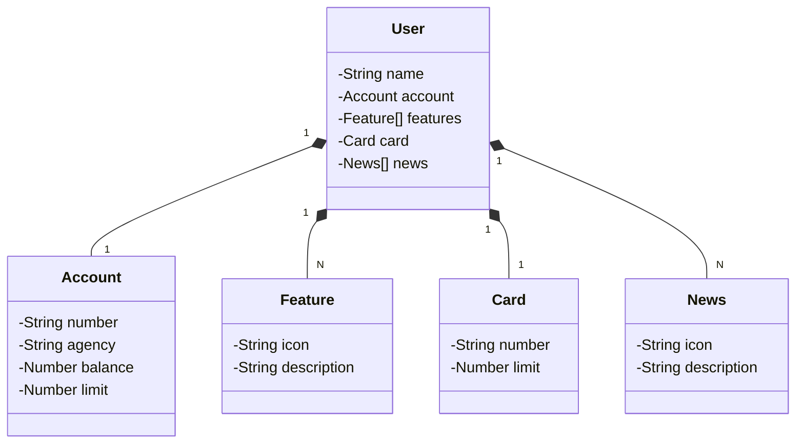

# Api Bank

RESTful API constuida em Java 21 com Spring Boot 3.

## Tecnologias
- **java 21**: A versão LTS mais recente do Java.
- **Spring boot 3**: A mais nova versão do Spring Boot.
- **Spring Data JPA**
- **OpenAPI (Swagger)**

## Diagrama de classes

